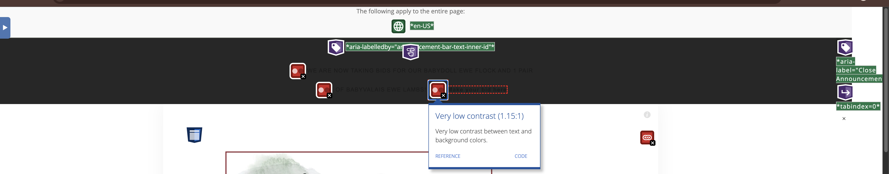

# Homepage — Accessibility Findings

**Page:** [littleflowerlambs.com](https://littleflowerlambs.com) (homepage) **Audited:** July 5, 2026 **Environment:** Chrome (incognito), snapshot mode **Standard:** WCAG 2.1

Baseline (full page, no audit markup):

## Tools & Scores

| Tool | Result |
| --- | --- |
| Lighthouse (desktop) | Accessibility 26/28 |
| Lighthouse (mobile, Moto G Power emulation) | Accessibility 26/28 — equivalent to desktop |
| WAVE (wave.webaim.org) | 6 errors · 33 contrast errors · 7 alerts |
| Manual keyboard navigation | Multiple issues (see below) |

Desktop and mobile audits returned equivalent findings; no mobile-specific failures (touch targets passed on both).

Lighthouse desktop:

Lighthouse mobile:

WAVE summary:

---

## Fixed

*(No confirmed fixes yet — see candidates below. This section fills in after the edit pass, with before/after screenshots.)*

### Candidates (pending fix)

- **Low-contrast text — announcement bar** — template-level, recurs site-wide. Documented example measured 1.15:1 (WCAG AA requires 4.5:1). Full write-up, fix path, and evidence in `site-wide-issues.md` (issue 1). Evidence: `../screenshots/homepage/wave-contrast-announcementbar.png`. *WCAG 1.4.3.*

Full page with WAVE contrast flags:

Close-up — announcement bar contrast error:

---

## Identified But Not Fixed

- **Navigation submenus are not keyboard-operable** — parent nav items receive focus but do not expand on Enter or Space. Submenu child links are only reachable by tabbing through a visually hidden menu. *WCAG 2.1.1.* May require code injection or be locked at the platform/contractor-access level.
- **Focus indicator not consistently visible** — the visible focus outline is lost partway down the page; focus position could only be inferred from the browser status-bar URL preview. *WCAG 2.4.7.*
- **Illogical focus order** — tab traversal through the hidden submenu items does not follow a predictable visual or reading sequence. *WCAG 2.4.3.*
- **Footer keyboard-unreachable** — template-level, recurs site-wide. After the embedded video controls, focus skips all footer content and returns to browser chrome (not a trap — focus escapes — but the footer is bypassed). Full write-up in `site-wide-issues.md` (issue 2). *WCAG 2.4.3.*
- **Empty links (6)** — icon links with no discernible name. WAVE found 6; Lighthouse named 3: `a#mobile-close-nav.icon-close`, `a.sqs-svg-icon--wrapper.pinterest`, `a.icon-info-circle`. Some are Squarespace-generated (mobile close-nav); others may be fixable via aria-label code injection (e.g., Pinterest). *WCAG 2.4.4 / 4.1.2.* Split — per-item review.
- **Heading order skip** — an `h3` ("THE LORD IS MY SHEPHERD.") appears without a preceding `h2`. WAVE also flagged 2 skipped heading levels and 1 possible heading. *WCAG 1.3.1.* Squarespace heading structure.
- **Redundant links (3)** — same destination linked in adjacent elements (e.g., logo and text both to home). WAVE alert, minor. Likely template-level; see `site-wide-issues.md` (issue 3, pending site-wide confirmation).
- **No skip link** — no "skip to content" link appears on the first Tab press. *WCAG 2.4.1.* Low priority: the page is short and single-column, so the impact is minimal. Noted for consistency and best practice.

---

## Outside Scope

- **Text-over-photo contrast** — Lighthouse flagged nav labels (SHEEP, POLISH TATRA SHEEPDOGS, FOR SALE, ABOUT) rendered on the `div#canvas` hero banner image. WAVE correctly did not flag these, because it cannot measure contrast over background images. Fixing text-over-image contrast requires a scrim or overlay treatment or a design change, beyond style-panel edits. *WCAG 1.4.3.*
- **Video captions** — the background `<video>` has no `<track kind="captions">`. Informational in Lighthouse; the video is decorative/background with no spoken content. *WCAG 1.2.2.*
- **Cross-browser / screen-reader combination testing** — excluded per the predefined audit scope.

---

## Tool-Behavior Notes

- WAVE cannot measure contrast on text placed over background **images** — it evaluates solid-color backgrounds only. A passing WAVE contrast result does **not** clear text-over-photo; that must be checked manually or with Lighthouse. Confirmed live: Lighthouse *passed* page contrast while WAVE flagged 33 contrast errors — the two tools measure different things.
- Lighthouse flags text-over-image contrast (`div#canvas`) that WAVE ignores. Using both tools covers each other's blind spots.

---

## Open Questions

- Does WAVE's "33 contrast errors" represent 33 distinct fixes, or repeated instances of a few elements? (Confirm at the fix pass.)
- Can the Pinterest / info-circle link names be set via Squarespace code injection at contractor access level, or are they platform-locked?
- Are the header (announcement bar) and footer (video, Pinterest, redundant links) template-level elements that repeat site-wide? If so, one template-level fix resolves them across all pages. (Investigate as pages 2–10 are audited.)
